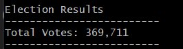
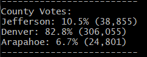
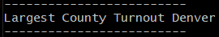
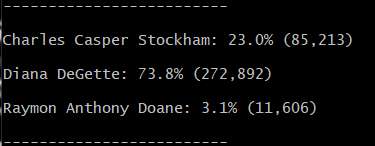
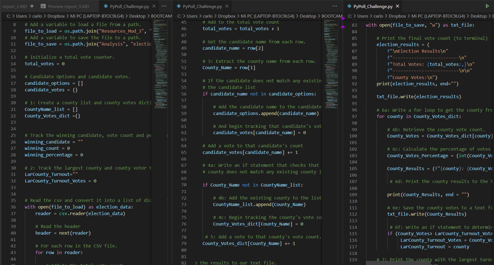

# Report # 3, Election Analysis and Python

 <h2> Abstract: 

The Colorado Board of Elections has given a data set of 369,711 voters of the congregational elections. 
This, with the purpose to analyse and give information regarding the total number of votes cast, the complete list of candidates who received votes, 
the total number of votes each candidate received, the percentage of votes each candidate won, the winner of the election based on popular vote and the percentage votes per county. 
Furthermore, by using the given (csv data set) file and the programming software Python , it was determined that the winner of the election was Diana DeGette with 272,892 votes,
which represents a 73.8% of the total voters and that the largest county turnout was Denver. 
In this report, it is found an analysis of the election audit for the election commission, the results and methods used.

 <h2> Election-Audit Results: 

- How many votes were cast in this congressional election? 
    - There were 369,711  
       
      figure obtained from the gitbash terminal  

- Breakdown of the number of votes and the percentage of total votes for each county in the precinct. 
    - County Results:
      - Jefferson: 10.5% - 38,855 votes
      - Denver: 82.8% - 306,055 votes
      - Arapahoe: 6.7% - 24,801 votes  
   
  figure obtained from the gitbash terminal   
 
- Which county had the largest number of votes? 
    - The county with the largest number of votes was Denver  
   
  figure obtained from the gitbash terminal
    
-  Breakdown of the number of votes and the percentage of the total votes each candidate received. 
     - Candidate Results
       - Charles Casper Stockham: 23.0% - 85,213 votes
       - Diana DeGette: 73.8% - 272,892 votes
       - Raymon Anthony Doane: 3.1% - 11,606 votes  
          
        figure obtained form the gitbash terminal   

- Which candidate won the election, what was their vote count, and what was their percentage of the total votes? 
    - Winner:
        - Winning Candidate was Diana DeGette
        - Winning Vote Count was 272,892
        - Winning Percentage was 73.8%  
  
      
        figure obtained from the gitbash terminal   

 <h2> Methods Used: 
 

With the purpose of finding the information of the election results, a csv files was opened with python in order to extract the necessary information to complete the given task.
Due to the fact that the csv file has 3 columns: ID Ballot, County and Candidate, while using python, it had to be searched through the candidates columns and count how many votes each of the candidates received. 
Once the total votes and total percentage of each of the candidates, the results were written into a .txt file. 
Following, the program searches in the counties column to determine the total votes and percentage of each county. This, with the purpose to find which county is the largest of all (see the script below).  

   

 <h2> Election-Audit Analysis and Discussion: 

As it can be seen in the image below, the participants in this elections were 369,711 voters in 3 different counties
involved in the electoral process for the congregational position: Jefferson, Denver and Arapahoe. 
The first county, of the previously mentioned, had a total participation of 10.5%, that is to say, there were 38,855 voters.
This could suggest that either the county is very small, or there are very few adults, or voters do not take interest in politics. It should be analysed
how much participation does citizens take so it can be corrected in future elections analysis. Additionally, since this elections were held in the US, the federal system should be considered.
Therefore, the size of the county most be taken into account (in future analysis) due to the fact that it could affect negatively the results of the non-elected candidates. 
In other words, perhaps in that county everyone voted for another candidate instead of the current winner,
therefore, even if all participants in that county vote against the current winner, 
this candidate would still win, due to the fact that Jefferson do not represents an equal share of the total.
This most be considered when auditing an electoral campaign in the US in order to weight correctly the vote per county and thus determine the winner. This is the same case as Arapahoe, 
with a participation of 6.7%, which represents 24,801 voters. Regarding Denver, it had a participation of 82.8%, that is,  306,055 voters. This county has the largest county turnout.

Furthermore, as show in the image below, there were 3 candidates: Charles Casper, Diana DeGette, and Raymon Anthony Doane Stockham. 
The first candidate, had a 23.0% of the total participation, which represents a total of 85,213 votes. 
The second candidate, Diana DeGette, had a 73.8% of the total percentage, clearly she has the vast majority of the votes, thus she is the winner, although the importance and size of the county should be taken into account for future elections.
This, with the purpose to analyse how strong is her political impact around the nation. She represents a total of 272,892 votes. However, it is not clear from which county she is gaining most of the votes or where is she acquiring these votes. 
Regarding the third candidate, he had a 3.1% total percentage of participation, representing 11,606 votes of the electoral campaign. In addition to the previous, 
a statistical program or statistical analysis should be implemented in order to have more accurate data. 
  

 
 figure obtained from the gitbash terminal

 <h2> Election-Audit Summary: 

Along this report the election outcomes was analysed while explaining the methods used. The winner was Diana DeGette, with 272,892 votes, representing a 73.8 percent of the total. The largest county turnout was Denver with 82.8%.
Even though, the previous data was obtained, this script can me ameliorated or modified in order to improve election auditing. For instance, by implementing a statistical program with python,
it could help to add more useful information in order to analyse the election results better. Additionally, it could be implemented a program to calculate how many votes does a candidate has in a given county.
This, with the purpose to analyse where does the candidate is more popular. For further analysis, a program that calculates how many citizens did not vote should be conducted in order to improve
election auditing. Finally, a refactored code should be considered in order to implement larger data sets and the computational performance improves. 

